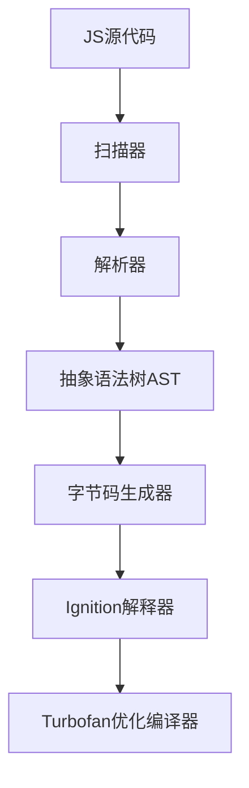

# V8 核心原理

## 1. 解析与编译流程

## 2. 核心组件
### 扫描器(Scanner)
- 词法分析
- 生成Token
- 支持Unicode处理

### 解析器(Parser)
- 语法分析
- 构建抽象语法树
- 符合ECMAScript规范

### Ignition解释器
- 生成字节码
- 快速执行
- 收集类型反馈信息

### Turbofan优化编译器
- 即时编译(JIT)
- 类型特化优化
- 生成机器码

### 垃圾回收器(GC)
- 分代式回收
- 并行标记
- 增量式清除

## 3. 内存管理
- 堆内存组织
- 对象表示方式
- 指针压缩技术
- 内存沙盒安全机制

## 4. 运行时特性
- 事件循环集成
- API绑定机制
- 调试支持
- WebAssembly编译
- 快照(Snapshot)技术

## 5. 性能优化
- 隐藏类(Hidden Class)
- 内联缓存(Inline Cache)
- 热点代码检测
- 去优化机制

## 6. 重要数据结构
- 句柄(Handle)系统
- 上下文(Context)隔离
- 属性字典
- 反馈向量(Feedback Vector)
